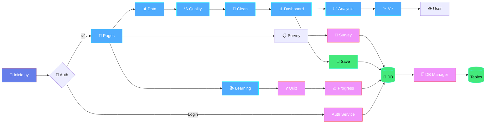
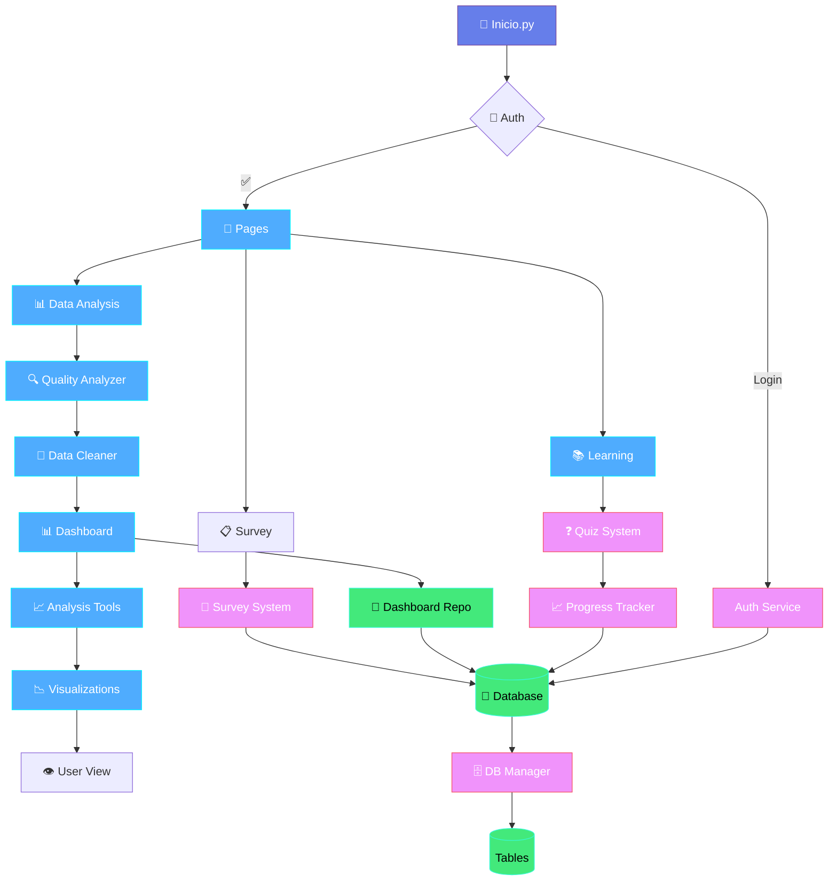

# 🏗️ TCC Platform - Architecture Diagram

## System Architecture Overview

Este diagrama muestra cómo los diferentes módulos y componentes de la plataforma TCC se conectan entre sí y cómo los datos fluyen desde el usuario hasta la base de datos.

---

## 👁️ Cómo Visualizar este Diagrama Mermaid

### Opción 1: Mermaid Live Editor (Más Rápida) ⚡
1. Ve a https://mermaid.live/
2. Copia el código Mermaid desde la sección "High-Level Architecture Flow" (líneas 11-76)
3. Pégalo en el editor
4. Verás el diagrama renderizado en tiempo real

### Opción 2: GitHub (Si subes el proyecto) 📦
- Si subes este archivo `.md` a GitHub, se renderiza automáticamente
- GitHub soporta Mermaid nativamente en Markdown

### Opción 3: Extensiones de VS Code/Cursor 🔌
Instala una de estas extensiones:
- **Markdown Preview Mermaid Support** - Agrega soporte Mermaid al preview
- **Mermaid Preview** - Preview dedicado para Mermaid
- **Markdown All in One** - Preview de Markdown con soporte Mermaid

Después de instalar, abre el preview del Markdown (Ctrl+Shift+V / Cmd+Shift+V)

### Opción 4: Herramientas Online 🌐
- **Obsidian** - Editor de notas que soporta Mermaid
- **Notion** - Soporta bloques de código Mermaid
- **Typora** - Editor Markdown con soporte Mermaid

### Opción 5: Visual Studio Code con Extensión 📝
1. Instala "Markdown Preview Mermaid Support"
2. Abre el archivo `.md` en VS Code
3. Presiona `Ctrl+Shift+V` (Windows/Linux) o `Cmd+Shift+V` (Mac)
4. El diagrama se renderizará en el preview

---

## 📊 High-Level Architecture Flow

### Versión Horizontal (Recomendada para Word)



### Versión Vertical Compacta



---

## 🔄 Conexiones del Sistema - Diagrama Simplificado

### Flujo General de Conexiones

```
┌─────────────────────────────────────────────────────────────────┐
│                         INICIO.PY                                │
│                      (Entry Point)                               │
└─────────────────────────────┬───────────────────────────────────┘
                              │
                              ▼
                    ┌─────────────────┐
                    │  Authentication │
                    └────────┬────────┘
                             │
              ┌──────────────┼──────────────┐
              │              │              │
              ▼              ▼              ▼
    ┌─────────────┐  ┌─────────────┐  ┌─────────────┐
    │ Auth Service│  │  Main Pages │  │   OAuth     │
    └──────┬──────┘  └──────┬──────┘  └──────┬──────┘
           │                │                 │
           └────────────────┼─────────────────┘
                            │
                            ▼
                    ┌───────────────┐
                    │   DATABASE    │
                    │  (SQLite/     │
                    │  PostgreSQL)  │
                    └───────┬───────┘
                            │
        ┌───────────────────┼───────────────────┐
        │                   │                   │
        ▼                   ▼                   ▼
┌──────────────┐   ┌──────────────┐   ┌──────────────┐
│   LEARNING   │   │  DATA FLOW   │   │   SURVEYS    │
│    PATH      │   │    PATH      │   │    PATH      │
└──────┬───────┘   └──────┬───────┘   └──────┬───────┘
       │                  │                  │
       ▼                  ▼                  ▼
┌──────────────┐   ┌──────────────┐   ┌──────────────┐
│  Level Pages │   │ Data Upload  │   │ Survey Pages │
│  (00-04)     │   │   Handling   │   │  (99_Survey) │
└──────┬───────┘   └──────┬───────┘   └──────┬───────┘
       │                  │                  │
       ▼                  ▼                  ▼
┌──────────────┐   ┌──────────────┐   ┌──────────────┐
│Quiz System   │   │Quality Analyz│   │Survey System │
│Progress Track│   │Data Cleaner  │   │Response Mgr  │
└──────┬───────┘   └──────┬───────┘   └──────┬───────┘
       │                  │                  │
       └──────────────────┼──────────────────┘
                          │
                          ▼
                  ┌───────────────┐
                  │   DATABASE    │
                  │               │
                  │ • user_progress│
                  │ • quiz_attempts│
                  │ • dashboards   │
                  │ • survey_resp. │
                  └───────┬───────┘
                          │
                          ▼
                  ┌───────────────┐
                  │  User View    │
                  │ (Streamlit UI)│
                  └───────────────┘
```

### Conexiones por Módulo

**Core Modules → Database:**
- `auth_service.py` → `users`, `user_sessions` tables
- `progress_tracker.py` → `user_progress` table
- `quiz_system.py` → `quiz_attempts` table
- `survey_system.py` → `survey_responses` table
- `dashboard_repository.py` → `dashboards` table

**Utils Modules → Session State:**
- `utils/data/data_handling.py` → `st.session_state.uploaded_data`
- `utils/data/data_cleaner.py` → `st.session_state.cleaned_data`
- `utils/dashboard/` → `st.session_state.dashboard_components`

**Utils Modules → Analysis:**
- `utils/analysis/` → `utils/dashboard/dashboard_renderer.py` → User View
- `utils/learning/` → `core/quiz_system.py` → Database

---

## 🔍 Flujos Detallados de Funcionamiento - Background Processes

### 🔐 Flujo 1: Autenticación y Login - Proceso en Background

```
┌──────────────────────────────────────────────────────────────┐
│ 1. USUARIO INGRESA CREDENCIALES                              │
│    └─> Streamlit UI (pages/07_OAuth_Login.py)                │
└────────────────────┬─────────────────────────────────────────┘
                     │
                     ▼
┌──────────────────────────────────────────────────────────────┐
│ 2. SECURITY VALIDATION                                        │
│    ├─> sanitize_input_for_db(username)                       │
│    ├─> check_rate_limit(username)                            │
│    │   └─> Verifica intentos fallidos (5 max)                │
│    │   └─> Verifica tiempo de bloqueo                        │
│    └─> Si excede límite → Return error                       │
└────────────────────┬─────────────────────────────────────────┘
                     │
                     ▼
┌──────────────────────────────────────────────────────────────┐
│ 3. DATABASE QUERY                                             │
│    └─> SELECT * FROM users                                    │
│        WHERE username = ? AND is_active = TRUE               │
│    ├─> Si usuario no existe → Return "Invalid credentials"   │
│    └─> Si existe → Obtener user record                       │
└────────────────────┬─────────────────────────────────────────┘
                     │
                     ▼
┌──────────────────────────────────────────────────────────────┐
│ 4. ACCOUNT LOCK CHECK                                         │
│    ├─> Verificar locked_until                                │
│    ├─> Si bloqueado y tiempo expirado → unlock_account()     │
│    └─> Si bloqueado y tiempo NO expirado → Return error      │
└────────────────────┬─────────────────────────────────────────┘
                     │
                     ▼
┌──────────────────────────────────────────────────────────────┐
│ 5. PASSWORD VERIFICATION                                      │
│    └─> verify_password(password, user['password_hash'])      │
│        ├─> bcrypt.checkpw(password, hash)                    │
│        ├─> Si incorrecto → increment_failed_attempts()       │
│        ├─> Si >= 5 fallos → lock_account()                   │
│        ├─> record_attempt(username, False)                   │
│        └─> Return False                                       │
│    └─> Si correcto → Continue                                │
└────────────────────┬─────────────────────────────────────────┘
                     │
                     ▼
┌──────────────────────────────────────────────────────────────┐
│ 6. SUCCESSFUL LOGIN PROCESSING                                │
│    ├─> reset_failed_attempts(user_id)                        │
│    ├─> record_attempt(username, True)                        │
│    ├─> update_last_login(user_id)                            │
│    │   └─> UPDATE users SET last_login = NOW()               │
│    └─> create_session(user_id)                               │
│        ├─> generate_session_token()                          │
│        ├─> INSERT INTO user_sessions                         │
│        │   (user_id, token, created_at, expires_at)          │
│        └─> Return session_token                              │
└────────────────────┬─────────────────────────────────────────┘
                     │
                     ▼
┌──────────────────────────────────────────────────────────────┐
│ 7. SESSION STATE UPDATE                                       │
│    ├─> st.session_state.user = user_data                     │
│    │   └─> {id, username, email, first_name, last_name}      │
│    ├─> st.session_state.authenticated = True                 │
│    └─> st.session_state.session_token = token                │
└────────────────────┬─────────────────────────────────────────┘
                     │
                     ▼
┌──────────────────────────────────────────────────────────────┐
│ 8. REDIRECT                                                   │
│    └─> st.switch_page("Inicio.py")                           │
│        └─> Usuario ve Dashboard Principal                    │
└──────────────────────────────────────────────────────────────┘
```

**Tablas de Base de Datos Modificadas:**
- `users` → `last_login`, `failed_attempts`, `locked_until`
- `user_sessions` → Nueva sesión creada

---

### 📚 Flujo 2: Progresión de Niveles - Proceso en Background

```
┌──────────────────────────────────────────────────────────────┐
│ 1. USUARIO ACCEDE A NIVEL                                     │
│    └─> pages/01_Nivel_X.py (donde X = 0-4)                   │
└────────────────────┬─────────────────────────────────────────┘
                     │
                     ▼
┌──────────────────────────────────────────────────────────────┐
│ 2. CARGAR PROGRESO ACTUAL                                     │
│    └─> get_level_progress(user_id)                           │
│        ├─> progress_tracker.get_user_progress(user_id)       │
│        │   ├─> Verificar cache _cache[user_id]               │
│        │   └─> Si no en cache → Query DB                     │
│        │       └─> SELECT * FROM user_progress               │
│        │           WHERE user_id = ?                          │
│        └─> Retorna: nivelX_completed flags                   │
└────────────────────┬─────────────────────────────────────────┘
                     │
                     ▼
┌──────────────────────────────────────────────────────────────┐
│ 3. MOSTRAR CONTENIDO DEL NIVEL                                │
│    ├─> level_components.py → Renderiza UI                    │
│    ├─> level_data.py → Carga contenido educativo             │
│    └─> Usuario lee y interactúa                              │
└────────────────────┬─────────────────────────────────────────┘
                     │
                     ▼
┌──────────────────────────────────────────────────────────────┐
│ 4. USUARIO INICIA QUIZ                                        │
│    └─> create_quiz(level, username)                          │
│        ├─> Obtener preguntas: QUIZ_QUESTIONS[level]          │
│        ├─> Randomizar orden                                  │
│        └─> Mostrar formulario interactivo                    │
└────────────────────┬─────────────────────────────────────────┘
                     │
                     ▼
┌──────────────────────────────────────────────────────────────┐
│ 5. USUARIO ENVÍA RESPUESTAS                                   │
│    └─> Al presionar "Enviar Quiz"                            │
└────────────────────┬─────────────────────────────────────────┘
                     │
                     ▼
┌──────────────────────────────────────────────────────────────┐
│ 6. PROCESAR RESPUESTAS Y CALCULAR SCORE                       │
│    ├─> Comparar respuestas con correctas                     │
│    ├─> Calcular: score, total_questions, percentage          │
│    ├─> percentage = (score / total) * 100                    │
│    └─> passed = percentage >= 70                             │
└────────────────────┬─────────────────────────────────────────┘
                     │
                     ▼
┌──────────────────────────────────────────────────────────────┐
│ 7. GUARDAR INTENTO EN BASE DE DATOS                           │
│    └─> save_quiz_attempt(level, username, ...)               │
│        ├─> Query: SELECT id FROM users WHERE username = ?     │
│        │   └─> Obtener user_id                               │
│        ├─> INSERT INTO quiz_attempts                         │
│        │   (user_id, level, score, total_questions,          │
│        │    percentage, passed, completed_at)                │
│        └─> Para cada respuesta:                              │
│            └─> INSERT INTO quiz_answers                      │
│                (quiz_attempt_id, question_text,              │
│                 selected_answer, correct_answer,             │
│                 is_correct, explanation)                     │
└────────────────────┬─────────────────────────────────────────┘
                     │
                     ▼
┌──────────────────────────────────────────────────────────────┐
│ 8. ACTUALIZAR PROGRESO SI PASÓ QUIZ                           │
│    └─> Si passed == True:                                    │
│        ├─> save_level_progress(user_id, level, completed=True)│
│        │   └─> progress_tracker.update_user_progress()       │
│        │       ├─> UPDATE user_progress                      │
│        │       │   SET nivelX_completed = TRUE               │
│        │       │   WHERE user_id = ?                         │
│        │       ├─> _invalidate_cache(user_id)                │
│        │       └─> Si nivel completado:                      │
│        │           └─> log_progress_activity()               │
│        │               └─> INSERT INTO progress_activity     │
│        └─> st.session_state[f'{level}_completed'] = True     │
└────────────────────┬─────────────────────────────────────────┘
                     │
                     ▼
┌──────────────────────────────────────────────────────────────┐
│ 9. VERIFICAR LOGROS Y ACTUALIZAR UI                           │
│    ├─> check_achievement(username, achievement_type)         │
│    ├─> Recalcular total_progress                             │
│    ├─> get_level_progress() → Actualizado desde DB          │
│    └─> Mostrar UI actualizada con nuevo progreso             │
└──────────────────────────────────────────────────────────────┘
```

**Tablas de Base de Datos Modificadas:**
- `quiz_attempts` → Nuevo intento insertado
- `quiz_answers` → Respuestas individuales insertadas
- `user_progress` → `nivelX_completed` actualizado a TRUE
- `progress_activity` → Actividad registrada

---

### 📊 Flujo 3: Análisis de Datos - Proceso en Background

```
┌──────────────────────────────────────────────────────────────┐
│ 1. USUARIO SUBE ARCHIVO                                       │
│    └─> pages/08_Dashboard_Blanco.py                          │
│        └─> st.file_uploader(type=['csv', 'xlsx'])            │
└────────────────────┬─────────────────────────────────────────┘
                     │
                     ▼
┌──────────────────────────────────────────────────────────────┐
│ 2. CARGAR Y PARSEAR ARCHIVO                                   │
│    └─> load_uploaded_dataframe(uploaded_file)                │
│        ├─> Si .csv → pd.read_csv()                           │
│        ├─> Si .xlsx/.xls → pd.read_excel()                   │
│        ├─> Detectar tipos de datos automáticamente           │
│        └─> Intentar convertir columnas de fecha              │
└────────────────────┬─────────────────────────────────────────┘
                     │
                     ▼
┌──────────────────────────────────────────────────────────────┐
│ 3. GUARDAR EN SESSION STATE                                   │
│    ├─> st.session_state.uploaded_data = df                   │
│    ├─> st.session_state.dashboard_data_label = filename      │
│    └─> st.session_state.sample_data = None                   │
└────────────────────┬─────────────────────────────────────────┘
                     │
                     ▼
┌──────────────────────────────────────────────────────────────┐
│ 4. USUARIO SELECCIONA "ANALIZAR CALIDAD"                      │
│    └─> st.session_state.show_data_quality = True             │
└────────────────────┬─────────────────────────────────────────┘
                     │
                     ▼
┌──────────────────────────────────────────────────────────────┐
│ 5. EJECUTAR ANÁLISIS DE CALIDAD                               │
│    └─> analyze_data_quality(df)                              │
│        ├─> Información básica:                               │
│        │   └─> rows, columns, memory_usage, duplicates       │
│        ├─> Análisis de valores faltantes:                    │
│        │   └─> df.isnull().sum(), percentages                │
│        ├─> Análisis numérico:                                │
│        │   ├─> min, max, mean, median, std                   │
│        │   └─> Detección de outliers (método IQR)            │
│        ├─> Análisis categórico:                              │
│        │   └─> unique_values, most_common, empty_strings     │
│        └─> Análisis de fechas:                               │
│            └─> min_date, max_date, future_dates              │
└────────────────────┬─────────────────────────────────────────┘
                     │
                     ▼
┌──────────────────────────────────────────────────────────────┐
│ 6. GENERAR REPORTE DE CALIDAD                                 │
│    └─> create_quality_report(df, analysis)                   │
│        ├─> Mostrar métricas básicas                          │
│        ├─> Calcular Quality Score                            │
│        ├─> Mostrar visualizaciones (Plotly)                  │
│        │   ├─> Missing data heatmap                          │
│        │   ├─> Outliers detection charts                     │
│        │   └─> Data type distribution                        │
│        └─> Opciones de limpieza sugeridas                    │
└────────────────────┬─────────────────────────────────────────┘
                     │
                     ▼
┌──────────────────────────────────────────────────────────────┐
│ 7. USUARIO SELECCIONA "LIMPIEZA AUTOMÁTICA"                   │
│    └─> create_data_cleaning_interface(df, analysis)          │
└────────────────────┬─────────────────────────────────────────┘
                     │
                     ▼
┌──────────────────────────────────────────────────────────────┐
│ 8. APLICAR OPERACIONES DE LIMPIEZA                            │
│    └─> DataCleaner.apply_auto_cleaning(cleaning_options)     │
│        ├─> Si remove_missing:                                │
│        │   └─> df.dropna(subset=[columns])                   │
│        ├─> Si remove_duplicates:                             │
│        │   └─> df.drop_duplicates()                          │
│        ├─> Si handle_outliers:                               │
│        │   └─> Aplicar capping/winsorizing                   │
│        ├─> Si standardize_text:                              │
│        │   └─> df[col].str.strip().str.lower()              │
│        ├─> Si fix_data_types:                                │
│        │   └─> Conversión automática de tipos                │
│        └─> Guardar history de operaciones                    │
└────────────────────┬─────────────────────────────────────────┘
                     │
                     ▼
┌──────────────────────────────────────────────────────────────┐
│ 9. GUARDAR DATOS LIMPIOS EN SESSION STATE                     │
│    ├─> st.session_state.cleaned_data = cleaned_df            │
│    ├─> st.session_state.data_quality_completed = True        │
│    └─> st.session_state.cleaning_summary = summary           │
└────────────────────┬─────────────────────────────────────────┘
                     │
                     ▼
┌──────────────────────────────────────────────────────────────┐
│ 10. CONSTRUIR DASHBOARD                                        │
│     └─> st.session_state.show_dashboard = True               │
│         ├─> analyze_dataset_columns(cleaned_df)              │
│         │   └─> Categorizar columnas: numeric, text, date    │
│         ├─> Usuario selecciona columnas para visualizar      │
│         ├─> Usuario selecciona tipos de gráficos             │
│         └─> dashboard_renderer.render_dashboard()            │
│             ├─> Generar gráficos (Plotly)                    │
│             ├─> Calcular métricas                            │
│             └─> Mostrar visualizaciones interactivas         │
└────────────────────┬─────────────────────────────────────────┘
                     │
                     ▼
┌──────────────────────────────────────────────────────────────┐
│ 11. OPCIONAL: GUARDAR DASHBOARD                               │
│     └─> Si usuario presiona "Guardar Dashboard":             │
│         ├─> dashboard_repository.save_dashboard()            │
│         │   └─> INSERT INTO dashboards                       │
│         │       (user_id, name, config, created_at)          │
│         └─> Dashboard guardado para reutilización            │
└──────────────────────────────────────────────────────────────┘
```

**Tablas de Base de Datos Modificadas:**
- `dashboards` → Solo si usuario guarda (opcional)
- **Datos en Session State (no persistidos):**
  - `uploaded_data` → DataFrame original
  - `cleaned_data` → DataFrame limpiado
  - `cleaning_summary` → Historial de operaciones
  - `dashboard_components` → Configuración del dashboard

---

## 🔄 Detailed Data Flow (Version anterior - Referencia)

---

## 🗂️ Module Dependencies

### **Core Modules** (core/)
- `database.py` - Central database connection manager
- `auth_service.py` - User authentication & sessions
- `progress_tracker.py` - Learning progress tracking
- `quiz_system.py` - Quiz/question management
- `survey_system.py` - Survey functionality
- `dashboard_repository.py` - Dashboard persistence
- `data_quality_analyzer.py` - Data quality analysis
- `streamlit_error_handler.py` - Global error handling

### **Utility Modules** (utils/)

#### **analysis/** - Data analysis tools
- `calculations.py` - Metric calculations
- `filters.py` - Data filtering
- `metrics.py` - Statistical metrics
- `visualizations.py` - Chart generation

#### **dashboard/** - Dashboard components
- `dashboard_components.py` - UI components
- `dashboard_renderer.py` - Rendering engine
- `dashboard_sidebar.py` - Sidebar controls
- `dashboard_templates.py` - Pre-built templates

#### **data/** - Data processing
- `data_handling.py` - File upload & loading
- `data_cleaner.py` - Data cleaning operations
- `data_validation.py` - Data validation
- `data_cleaning_ops.py` - Cleaning operations

#### **learning/** - Learning system
- `level_components.py` - Level UI components
- `learning_progress.py` - Progress UI & helpers
- `level_data.py` - Level content data
- `level_styles.py` - Styling for levels
- `progression_tracker.py` - Progression logic

#### **ui/** - User interface
- `main_ui.py` - Main UI components
- `auth_ui.py` - Authentication UI
- `icon_system.py` - Icon management
- `ui_components.py` - Reusable UI components
- `error_handler.py` - Error UI handling

#### **system/** - System utilities
- `export.py` - Data export functionality
- `gif_utils.py` - GIF utilities

---

## 💾 Database Schema Connections

```
users (Core table)
  ├── user_sessions → Session management
  ├── user_progress → Learning progress
  ├── quiz_attempts → Quiz results
  ├── survey_responses → Survey answers
  └── dashboards → User dashboards
      └── dashboard_components → Dashboard parts
```

---

## 🎯 Key Integration Points

1. **Database Manager** - Single point of database access for all modules
2. **Session State** - Shared state management (st.session_state)
3. **Auth Service** - Centralized authentication for all pages
4. **Error Handler** - Global error handling across all modules
5. **UI Components** - Shared UI components used across pages

---

## 🔐 Security & Error Handling

```
User Action
  → Error Handler (core/streamlit_error_handler.py)
    → Security Features (core/security_features.py)
      → Validation
        → Core Module
          → Database Manager (with sanitization)
            → Database
```

---

## 📈 User Journey Example

**Learning Path:**
1. User logs in → `Auth Service` → `Database`
2. User accesses Level 1 → `Learning Pages` → `Level Components`
3. User completes quiz → `Quiz System` → `Progress Tracker` → `Database`
4. Progress saved → Shown in UI → `Main UI` displays progress

**Data Analysis Path:**
1. User uploads file → `Data Handling` → Stored in session state
2. User analyzes quality → `Data Quality Analyzer` → Results shown
3. User cleans data → `Data Cleaner` → Cleaned data in session state
4. User creates dashboard → `Dashboard Components` → `Visualizations`
5. User saves dashboard → `Dashboard Repository` → `Database`
6. Dashboard persisted → Available for later use

---

## 🔗 Module Communication Patterns

1. **Direct Import** - Modules import what they need directly
2. **Session State** - Shared data via `st.session_state`
3. **Database Manager** - Centralized database access
4. **Service Classes** - Core services (Auth, Progress, Quiz, Survey)
5. **UI Components** - Reusable UI functions called from pages

---

## 📐 Simplified Module Connection Map

### Text-Based Flow Diagram

```
┌─────────────────────────────────────────────────────────────────┐
│                    🚀 STREAMLIT APP ENTRY                        │
│                         Inicio.py                                │
└───────────────────────────┬─────────────────────────────────────┘
                            │
                            ▼
┌─────────────────────────────────────────────────────────────────┐
│                    🔐 AUTHENTICATION LAYER                       │
│  ┌──────────────────┐  ┌──────────────────┐  ┌──────────────┐ │
│  │  Login Pages     │  │  Auth Service    │  │  Auth UI     │ │
│  │  05_Registro.py  │→ │  core/auth_      │→ │  utils/ui/   │ │
│  │  06_Recuperar_   │  │    service.py    │  │    auth_ui   │ │
│  │  07_OAuth_Login  │  │                  │  │              │ │
│  └──────────────────┘  └────────┬─────────┘  └──────────────┘ │
└──────────────────────────────────┼──────────────────────────────┘
                                   │
                                   ▼
                        ┌──────────────────────┐
                        │   💾 DATABASE        │
                        │  (SQLite/PostgreSQL) │
                        │                      │
                        │  • users             │
                        │  • user_sessions     │
                        │  • user_progress     │
                        │  • quiz_attempts     │
                        │  • dashboards        │
                        │  • survey_responses  │
                        └──────────┬───────────┘
                                   │
        ┌──────────────────────────┼──────────────────────────┐
        │                          │                          │
        ▼                          ▼                          ▼
┌───────────────┐      ┌──────────────────┐      ┌──────────────────┐
│  📚 LEARNING  │      │  📊 DATA ANALYSIS │      │  📋 SURVEYS      │
│   PATH        │      │   PATH            │      │   PATH           │
└───────┬───────┘      └─────────┬────────┘      └─────────┬────────┘
        │                        │                          │
        ▼                        ▼                          ▼
┌──────────────────┐    ┌──────────────────┐    ┌──────────────────┐
│ Learning Pages   │    │ Data Upload      │    │ Survey Pages     │
│ 00-04_Nivel_X.py │    │ utils/data/      │    │ 99_Survey_X.py   │
└────────┬─────────┘    └────────┬─────────┘    └────────┬─────────┘
         │                       │                        │
         ▼                       ▼                        ▼
┌──────────────────┐    ┌──────────────────┐    ┌──────────────────┐
│ Level Components │    │ Data Quality     │    │ Survey System    │
│ utils/learning/  │    │ core/data_       │    │ core/survey_     │
│  level_comp...   │    │  quality_analyzer│    │  system.py       │
└────────┬─────────┘    └────────┬─────────┘    └────────┬─────────┘
         │                       │                        │
         ▼                       ▼                        ▼
┌──────────────────┐    ┌──────────────────┐              │
│ Quiz System      │    │ Data Cleaner     │              │
│ core/quiz_       │    │ utils/data/      │              │
│  system.py       │    │  data_cleaner.py │              │
└────────┬─────────┘    └────────┬─────────┘              │
         │                       │                         │
         ▼                       ▼                         ▼
┌──────────────────┐    ┌──────────────────┐    ┌──────────────────┐
│ Progress Tracker │    │ Dashboard        │    │                  │
│ core/progress_   │    │ utils/dashboard/ │    │                  │
│  tracker.py      │    │                  │    │                  │
└────────┬─────────┘    └────────┬─────────┘    └────────┬─────────┘
         │                       │                        │
         │                       ▼                        │
         │              ┌──────────────────┐              │
         │              │ Analysis Tools   │              │
         │              │ utils/analysis/  │              │
         │              └────────┬─────────┘              │
         │                       │                        │
         │                       ▼                        │
         │              ┌──────────────────┐              │
         │              │ Visualizations   │              │
         │              │ Dashboard Render │              │
         │              └────────┬─────────┘              │
         │                       │                        │
         └───────────────────────┼────────────────────────┘
                                 │
                                 ▼
                    ┌────────────────────────┐
                    │   👤 USER INTERFACE    │
                    │   (Streamlit Display)  │
                    └────────────────────────┘
```

---

## 🔄 Data Flow Summary

### Authentication → Database
```
User Input → Auth Service → Database Manager → Database
                                    ↓
                            Session State → Authenticated User
```

### Learning → Database
```
User Action → Level Page → Quiz → Progress Tracker → Database
                                      ↓
                            Progress Displayed to User
```

### Data Analysis → Visualization
```
File Upload → Quality Analysis → Data Cleaning → Analysis Tools
                                                      ↓
                              Dashboard Components → Visualizations
                                                      ↓
                                            User Views Charts
```

### Dashboard → Persistence
```
Dashboard Created → Dashboard Repository → Database
                                              ↓
                                    Saved for Later Use
```

---

*This diagram represents the high-level architecture. For detailed implementation, refer to individual module documentation.*

